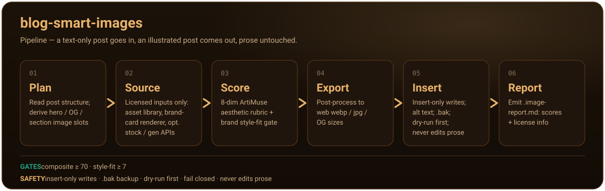

# blog-image-skill

[](https://github.com/Zora-waybox/blog-image-skill/actions/workflows/validate.yml)
[](LICENSE)
[](https://github.com/Zora-waybox/blog-image-skill)

[English](README.md) · **简体中文**

**博客文章的美学自动配图** —— 一个由 Waybox 出品的 Claude Code / agent-skill 插件。

给它一篇 Markdown 文章，它会根据文章结构规划图片位置，**仅从有授权的来源**取素材（仓库素材库、
离线品牌卡片渲染器，以及可选的 Pexels/Unsplash 或图像生成 API），用 **ArtiMuse 风格的 8 维美学
评分标准**（先批判、反正向偏差，综合分 ≥ 70 且风格契合度 ≥ 7 才通过）为每个候选打分，导出适配网页的
`webp/jpg/OG` 文件，并**在完全不改动正文一个字**的前提下插入头图和章节配图（仅插入式写入、`.bak`
备份、先空跑、失败即停）。每次运行都会生成一份 `.image-report.md`，含各维度评分与授权信息。

<p align="center">
  
</p>

## 快速开始

```
/plugin marketplace add Zora-waybox/blog-image-skill
/blog-image-skill:blog-smart-images content/blog/my-post.md
```

## 工作原理

1. **规划** —— 读取文章结构，推导出头图 / OG / 章节图的位置。
2. **取材** —— 仅从授权来源收集候选（素材库、品牌卡片渲染器、可选的图库 / 图像生成 API）。
3. **评分** —— 用 8 维美学标准加品牌风格契合度门槛为每个候选打分；仅接受综合分 ≥ 70 **且**风格契合度 ≥ 7。
4. **导出** —— 后处理成适配网页的 `webp` / `jpg` / OG 尺寸。
5. **插入** —— 用仅插入式安全写入插入头图和章节配图并附带 alt 文本（`.bak` 备份、先空跑、失败即停）；绝不改动正文。
6. **报告** —— 生成一份含各维度评分与授权信息的 `.image-report.md`。

## 可切换的视觉风格

一篇文章、一行 front matter，就能换一套视觉语言。预设影响的是**照片路径**——图库检索词、生图
提示词、调色和风格契合度判定——所以同一条流水线既能配一篇史诗感的国家公园路书，也能配一篇安静的
随笔，不用每次重新教它你的审美。（品牌卡片渲染器不受预设影响，始终保持你的卡片系统。）

```yaml
---
title: "犹他五大国家公园七日"
image_style: parks-golden-west
---
```

| 预设 | 视觉调性 | 什么时候用 |
|---|---|---|
| `livelike-warm` **（默认）** | 金色时刻、琥珀高光配青蓝阴影、有引导线的公路 | 博客的主调——公路旅行指南与对比测评 |
| `natgeo-doc` | 纪实感、诚实的自然光、真实色彩、把天气当主角 | 文章在讲事实：封路、野生动物、过境规则 |
| `vanlife-film` | Portra 胶片曲线、晨雾与营火黄昏、松弛的生活感 | 社群 / 生活方式类文章、第一人称旅行日记 |
| `kinfolk-minimal` | 柔和阴天、低饱和双色调、大面积留白 | 偏思辨的随笔——全套里最冷的一支，慎用 |
| `parks-golden-west` | 国家公园大片感：高山辉、巨大地貌、以小车衬托尺度 | 需要"加进愿望清单"冲动的路线指南 |
| `ig-editorial` | 强烈的青橙对比、第一眼就有钩子、能干净裁成 4:5 / 9:16 | 社媒优先的文章和 OG 社交图 |

写了不存在的预设 id 会怎样？运行时在报告里给出警告并回退到默认值，而不是自作主张猜一个。
想加自己的风格，去 [`references/style-presets.md`](skills/blog-smart-images/references/style-presets.md)
复制一个块即可：五个字段（光线 / 色彩 / 主体 / 构图 / 情绪），外加图库检索词、生图提示词内核和负面清单。

## 仓库结构

- `skills/blog-smart-images/SKILL.md` —— 工作流（7 步，硬性规则）
- `skills/blog-smart-images/references/aesthetic-rubric.md` —— 源自 ArtiMuse 的评分协议
- `skills/blog-smart-images/references/style-profile.md` —— 摄影语法 + 品牌 token（可按仓库覆盖）
- `skills/blog-smart-images/references/style-presets.md` —— 上面那六套可切换风格（可自行扩展）
- `skills/blog-smart-images/scripts/preview.py` —— 把配好图的文章渲染成栏宽预览页，顶部带全部配图的胶片带，发布前一眼看出整组图是否撞构图
- `skills/blog-smart-images/templates/card-base.html` —— 经生产验证的品牌卡片布局（头图、数据卡、倒计时、图表、终端、OG）
- `auto-illustrate.yml.example` + `INTEGRATION.zh-CN.md` —— 可直接放进你博客仓库的 CI；与 [cazerme/blog-marketing-skills](https://github.com/cazerme/blog-marketing-skills) 组合使用（先跑文本、再跑配图）

## 许可证

MIT —— 见 [LICENSE](LICENSE)。为 roadtripskill.dev 打造；风格配置可替换，欢迎接入你自己的品牌。
